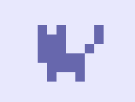

# Outline {background-color="indigo"}

1. What is Bitsy? Overview and examples.
2. The Bitsy Editor
3. Planning and developing your game
4. Saving and publishing your game

# Bitsy {background-color="indigo"}

 <!-- {.width=10} -->

[bitsy.org](https://www.bitsy.org/)

- A tool for building [8-bit video games](https://en.wikipedia.org/wiki/Third_generation_of_video_game_consoles)
- Open-source, browser-based, and easy-to-learn

# Examples

- [Chop Suey](https://skwabrynmawr.github.io/SUEY/CHOPSUEY.html) by Shiamin Kwa
- [Under a star called sun](https://haraiva.itch.io/under-a-star-called-sun) by Cecile Richard
- [pasta bake](https://ruin.itch.io/pasta-bake) by [Ruin](https://ruin.itch.io/)
- [Ally's famous bread rolls](https://enui.itch.io/allybread) by [enui](https://enui.itch.io/)

## {.smaller}

<iframe src="https://skwabrynmawr.github.io/SUEY/CHOPSUEY.html" width="600" height="600"></iframe>

[CHOPSUEY](https://skwabrynmawr.github.io/SUEY/CHOPSUEY.html) a Bitsy game by Shiamin Kwa

## {.smaller}

<iframe src="https://atmcgrath.github.io/kitten-game/" width="600" height="600"></iframe>

[Kitten-wrangler](https://atmcgrath.github.io/kitten-game/) by Alice McGrath. On GitHub: [atmcgrath/kitten-game](https://github.com/atmcgrath/kitten-game)

## Features of a Bitsy game 

::: {.incremental}

- Multiple rooms or spaces to move through
- Simple UI text
- Non-player characters to interact with
- Objects to pick up (can be counted)
- Exits and entrances (can have conditions/require keys)
- Music, sound effects, and simple animation options
:::

# The Bitsy Editor {background-color="indigo"}

A tour of the Bitsy editor interface: [make.bitsy.org/](https://make.bitsy.org/)

## Editor windows {.scrollable .smaller}

- **tools**: show the menu of tools, click to open each one
- **play**: test out your game
- **about**: instructions and documentation
- **game**: load or save your game
- **room**: the spaces your player interacts
  - The main editor interface: links up all the other windows
- **paint**: design and add your characters and objects
	- avatar: your player
	- tile: an obstacle square
	- sprite: NPC who can deliver information
	- item: objects you collect
- **exits & endings**: what happens when you finish a room
- **colors**: customize colors
- **dialog**: UI text and narrative elements (interaction conditions)
- **tune** and **blip**: music and sound effects
- **find**: search among your game resources
- **inventory**: keep track of items and variables

# Planning your game {background-color="indigo"}

## Storyboarding

- Who is your avatar character?
- Where are they? 
- What is their mission?
- Who and what will they interact with?

## UX design

- How will your player know what to do?
  - Dialogues and Sprite interactions
- Set up challenges and conditions
  - Locked exits, dialogs
- What should the spaces 

# Your turn! {.scrollable}

- Create two rooms
- Create an exit/entrance between the two rooms
- Place tiles to create obstacles
- Place your sprite and items

# End-game {background-color="indigo"}

## Saving and loading your game

- Select 'game' to open the export-import menu
- Select 'save game' to download your game as  `.html`
- When you want to work on it again, it may have been saved in your browser session. Otherwise, you can select 'load game' and upload the same html file

## Publishing your game

You have two options for publishing your game on the web: 

- [GitHub](https://github.com/) offers free webhosting through GitHub Pages
- BiCo folks can get a webhosting account through [Domain of One's Own (BMC)](https://digital.brynmawr.edu) or [Haverford Sites (HC)](https://sites.haverford.edu/)

## GitHub instructions {.scrollable .smaller}

### 1. Create a new repository

- Log in to [GitHub.com](https://github.com/) and create a new repository called "bitsy-game"
- Upload the html file for your game to the repository
- Rename the html file `index.html`

### 2. Publish your repository

- From your repository, go to the 'settings' tab and scroll down to pages
- Under 'Source' select 'deploy from a branch' and select "main" branch, then "save"
- Wait for a few minutes for the deployment to finish
- Your site's url: `username.github.io/bitsy-game`

NB: [this GitHub deployment guide](https://atmcgrath.github.io/intro-dh/resources/deployment.html) has step-by-step instructions and screenshots

## Domain of One's Own {.scrollable .smaller}

- Navigate to [digital.brynmawr.edu](https://digital.brynmawr.edu/) or [sites.haverford.edu](https://sites.haverford.edu/)
- Click 'Get Started' and sign in with your username
- Select a personal subdomain name (this will be part of your URL)
- Locate the "File Manager" (in the "Files" section) on the list of tools
- Navigate to the "public_html" folder
- Create a subfolder called "game" 
- Renaim your game file `index.html`
- Upload it to the "game" folder
- Your site's url: `yourdomain.digital.brynmawr.edu/game`

## Making changes

- Load your Bitsy game file back into the editor
- When you are done, export the html file and replace the old one on GitHub or DoOO

# Thanks! {background-color="indigo"}

Digital Scholarship Office Hours: Fridays 1-3 in the DMCL

Reach out at [digitalscholarship@brynmawr.edu](mailto:digitalscholarship@brynmawr.edu) or [help@brynmawr.edu](mailto:help@brynmawr.edu)

## Resources

### Bitsy

- This [Bitsy Handout](https://rahji.github.io/bitsy-handout/web/) has lots of resources
- Read the [Bitsy documentation](https://make.bitsy.org/docs/)
- Check out [other Bitsy games](https://itch.io/games/made-with-bitsy)

### Web publishing

- AskAthena's [Domain of One's Own documentation](https://askathena.brynmawr.edu/help/domain-of-ones-own)
- Guide to [GitHub Pages](https://pages.github.com/)