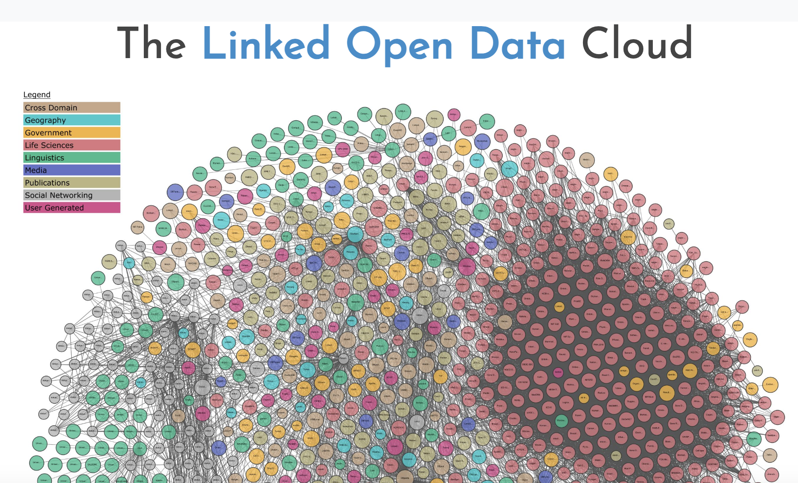
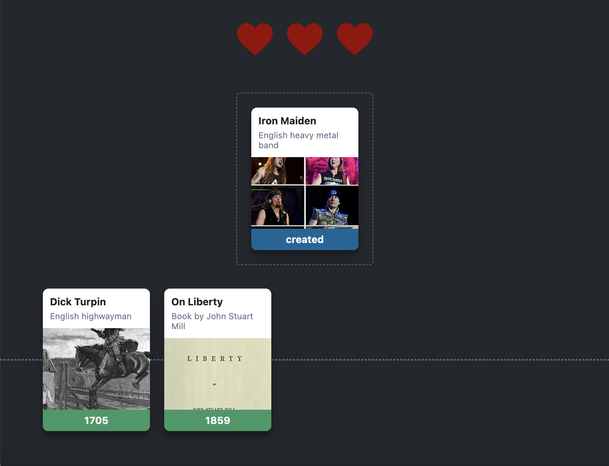

# Outline

1. Overview of Wikidata
2. Structure of Wikidata statements
3. Queries and other uses

# What is Wikidata? {background-color="indigo"}

> "A collaboratively edited multilingual knowledge graph hosted by the Wikimedia Foundation" 

- "[Wikidata](https://en.wikipedia.org/wiki/Wikidata)", Wikipedia.org

## Linked Open Data

The Linked Open Data Cloud ([view interactive version](https://lod-cloud.net/clouds/lod-cloud.svg) from [lod-cloud.net](https://lod-cloud.net/))

[Principles of Linked Data](https://www.w3.org/DesignIssues/LinkedData.html)

# How does it work? {background-color="indigo"}

## Concepts

- Data should be described in a standardized way
- URIs refer to the definition of a data category

## Wikidata statements

::: {.incremental}

- "The sky is blue"

- "The sky has the color blue"

- Semantic triple:
  - Subject - the sky - [Q527](https://www.wikidata.org/wiki/Q527)
  - Predicate - has the color - [P462](https://www.wikidata.org/wiki/Property:P462)
  - Object - blue - [Q1088](https://www.wikidata.org/wiki/Q1088)
:::

## Examples

::: {.incremental}

- Statements about *Clarissa*: [Q980534](https://www.wikidata.org/wiki/Q980534)
  - `Instance of` (P31) `written work` (Q47461344)
  - `genre` (P136) `epistolary novel` (Q465821)
  - `author` (P50) `Samuel Richardson` (Q295941)
:::

## Eliza Haywood 

- ID [Q1559438](https://www.wikidata.org/wiki/Q1559438)
- Occupation:
  - Novelist
  - Poet
  - Playwright
  - Actor
  - Editor
  - Philosopher
- VIAF cluster ID: 64027723

## Properties (for personography)

- Genre: [P136](https://www.wikidata.org/wiki/Property:P136)
- Gender: [P21](https://www.wikidata.org/wiki/Property:P21)
- Archives at: [P485](https://www.wikidata.org/wiki/Property:P485)
- Depicted by: [P1299](https://www.wikidata.org/wiki/Property:P1299)
- Described by source: [P1343](https://www.wikidata.org/wiki/Property:P1343)
- Has works in the collection: [P6379](https://www.wikidata.org/wiki/Property:P6379)

# What can you do with Wikidata? {background-color="indigo"}

## The Wikidata API {.smaller}

The game [Wikitrivia](https://wikitrivia.tomjwatson.com/) by Tom J. Watson uses the Wikidata API

## Uses

- Building open-source web resources
- Add data and images easily with digital publishing tools like [Juncture](https://www.juncture-digital.org/)
- Enhance a dataset: add Wikidata entity IDs to discover more information - e.g. [Bryn Mawr edit-a-thon](https://www.brynmawr.edu/stories/community-gathers-wikidata-edit-thon)
- Dataset discovery: add identifiers from other data resources to wikidata

## Wikidata Queries

- [Wikidata Query Service](https://query.wikidata.org/)-- SPARQL Queries
- [Wikidata Query Builder](https://query.wikidata.org/querybuilder/?uselang=en) -- GUI 
- [Wikidata SPARQL tutorial](https://www.wikidata.org/wiki/Wikidata:SPARQL_tutorial)

## Query structure

## Queries for an author

- Query template: [Generic queries for authors](https://www.wikidata.org/wiki/Template:Generic_queries_for_authors)

- [Eliza Haywood queries](https://www.wikidata.org/w/index.php?title=Talk:Q1559438&action=edit&redlink=1)

- [Eliza Haywood's timeline](https://query.wikidata.org/embed.html#%23defaultView%3ATimeline%0ASELECT%20DISTINCT%20%3Ftimestamp%20%3Fentity%20%3FrelationLabel%20%3FentityLabel%20%28SAMPLE%28%3Fimage%29%20AS%20%3Fimg%29%20WHERE%20%7B%0A%20%20BIND%28wd%3AQ1559438%20AS%20%3Fperson%29%0A%20%20%7B%0A%20%20%20%20%3Fperson%20%3Fproperty%20%3Ftimestamp.%0A%20%20%20%20%3Fentity%20wikibase%3AdirectClaim%20%3Fproperty.%0A%20%20%20%20FILTER%28%28DATATYPE%28%3Ftimestamp%29%29%20%3D%20xsd%3AdateTime%29%0A%20%20%7D%0A%20%20UNION%0A%20%20%7B%0A%20%20%20%20%3Fperson%20%3FentityToStatement%20%3Fstatement.%0A%20%20%20%20OPTIONAL%20%7B%20%3Fperson%20wdt%3AP570%20%3FdDate.%20%7D%0A%20%20%20%20%3Fstatement%20%3FstatementToQualifier%20%3Ftimestamp%3B%0A%20%20%20%20%20%20%3FstatementToValue%20%3Fentity.%0A%20%20%20%20%3Frelation%20wikibase%3AstatementProperty%20%3FstatementToValue.%0A%20%20%20%20FILTER%28REGEX%28STR%28%3FentityToStatement%29%2C%20%22prop%2FP%22%29%29%0A%20%20%20%20FILTER%28REGEX%28STR%28%3FstatementToQualifier%29%2C%20%22prop%2Fqualifier%2FP%22%29%29%0A%20%20%20%20FILTER%28%28DATATYPE%28%3Ftimestamp%29%29%20%3D%20xsd%3AdateTime%29%0A%20%20%20%20BIND%28IF%28%21%28BOUND%28%3FdDate%29%29%2C%20NOW%28%29%2C%20%3FdDate%29%20AS%20%3FdeathDate%29%0A%20%20%20%20FILTER%28%3Ftimestamp%20%3C%3D%20%3FdeathDate%29%0A%20%20%7D%0A%20%20UNION%0A%20%20%7B%0A%20%20%20%20BIND%28wd%3AP50%20AS%20%3Frelation%29%0A%20%20%20%20%3Frelation%20wikibase%3AdirectClaim%20%3Fproperty.%0A%20%20%20%20%3Fentity%20%3Fproperty%20%3Fperson%3B%0A%20%20%20%20%20%20wdt%3AP577%20%3Ftimestamp.%0A%20%20%20%20FILTER%28NOT%20EXISTS%20%7B%20%3Fperson%20wdt%3AP800%20%3Fentity.%20%7D%29%0A%20%20%7D%0A%20%20UNION%0A%20%20%7B%0A%20%20%20%20BIND%28wd%3AP800%20AS%20%3Frelation%29%0A%20%20%20%20%3Frelation%20wikibase%3AdirectClaim%20%3Fproperty.%0A%20%20%20%20%3Fperson%20%3Fproperty%20%3Fentity.%0A%20%20%20%20%3Fentity%20wdt%3AP577%20%3Ftimestamp.%0A%20%20%7D%0A%20%20OPTIONAL%20%7B%20%3Fentity%20wdt%3AP18%20%3Fimage.%20%7D%0A%20%20SERVICE%20wikibase%3Alabel%20%7B%20bd%3AserviceParam%20wikibase%3Alanguage%20%22en%2Cde%2Cfr%22.%20%7D%0A%7D%0AGROUP%20BY%20%3Ftimestamp%20%3Fentity%20%3FrelationLabel%20%3FentityLabel)
- Other templates listed at [Template:Item documentation](https://www.wikidata.org/wiki/Template:Item_documentation)

# Editing Wikidata {background-color="indigo"}

## Log in

- Wikidata.org [Login URL](https://auth.wikimedia.org/wikidatawiki/wiki/Special:UserLogin?useformat=desktop&usesul3=1&returnto=Main_Page&centralauthLoginToken=6b995b9e158d3634e431d709e941225a)

## Getting started

[Wikidata Tours](https://www.wikidata.org/wiki/Wikidata:Tours)

## Resources

- [How to Edit Wikidata: a step by step guide (pdf slides)](https://upload.wikimedia.org/wikipedia/commons/9/94/How_to_Edit_Wikidata.pdf)
- [How to add references](https://www.wikidata.org/wiki/Wikidata:Tours/References)
- [NYU Libraries libguide: Wikimedia Toolkit](https://guides.nyu.edu/wikimedia-toolkit/editing-wikidata)
- ["Designing a Wikidata Project: Mapping Black Philly Art"](https://sites.temple.edu/tudsc/2021/12/15/designing-wikidata/), Synatra Smith (12.15.21)